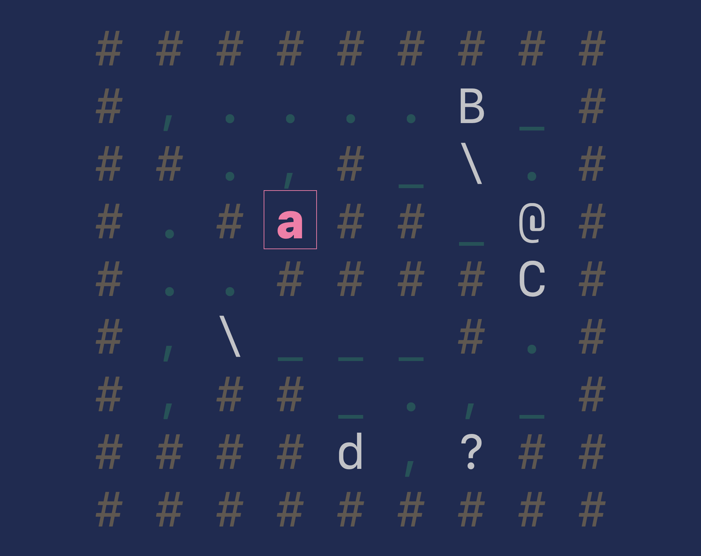

Z.E.A.L.O.T.S. is a minimilastic puzzle roguelike, created for the 2024 [7-Day Roguelike
Challenge](https://itch.io/jam/7drl-challenge-2024). You start the game as an Adept on a quest to ascend
the Pyramid of Knowledge and become a Zealot. You will encounter Borogoves and Yetis, Centipedes and
Xenomorphs, Demiliches and Wyverns, Elephants and Vultures, Fungi and Unicorns, Golems and Tarasques,
Hattifatteners and Shoggoths, Ifrits and Rocs, Jabberwocks and Quetzalcoatls, Krakens and Pirates,
Lemurians and Odradeks, and Mermaids and Nereids during your journey. You will merge your Essence with all
of them to attain your goal, but you will proceed with caution as losing your Essence will condemn you to
tarry for eternity in Limbo instead.

 
